# Shell Health Horizon — Dashboard Walkthrough

**Live URL:** [olatechie.github.io/health-horizon-dashboard-mockup](https://olatechie.github.io/health-horizon-dashboard-mockup/)
**Repository:** [github.com/olaTechie/health-horizon-dashboard-mockup](https://github.com/olaTechie/health-horizon-dashboard-mockup)
**Status:** Illustrative prototype for Shell Health Horizon Scanning RFI (Deliverable C). Real-event-grounded mock data; not vendor-validated; Shell Pecten not displayed (per RFI clause 3.d).

---

## 1. What this dashboard is

A static, browser-only prototype of the **Executive Intelligence Dashboard** described as Deliverable C in the RFI:

> Live, continuously updated signal tracker; filterable by PPA pillar, geography, business segment, alert tier; geographic overlay mapped to Shell operational footprint; accessible to Shell Health, HSSE policy, and regional health leads.

It is the visible surface of the AI-Augmented Living Intelligence Architecture proposed in our methodology — five thematic agents (Infectious Disease, Occupational Exposure, Regulatory & Standards, Climate–Health, Psychosocial Risk) continuously scanning peer-reviewed literature, WHO/ECDC alerts, regulatory dockets and industry bodies, with multi-source triangulation enforced before any tier escalation.

Every signal in the prototype is grounded in genuinely active 2025–2026 global health storylines (Mpox clade Ib, NIOSH heat-stress NPRM, AMR carbapenem resistance, WBGT exposure thresholds, etc.) so evaluators can judge the *plausibility* of the agent layer's output rather than its glossiness.

## 2. Architecture at a glance

| Layer | Implementation |
|---|---|
| Routes | 5 statically-generated pages (Dashboard, Signal Explorer, Signal Detail, Geographic, Briefs) |
| Stack | Next.js 15 (App Router, `output: 'export'`) · TypeScript strict · Tailwind v4 · MapLibre GL · Recharts · Framer Motion |
| Data | Static JSON in `/public/data/*.json` — mirrors the shape the production agent layer would emit |
| Themes | Editorial light (default) + Ops dark — both first-class, toggled via `data-theme` |
| Hosting | GitHub Pages (`output: 'export'` + GH Action), basePath-aware throughout |
| Mock data | 40 signals × 5 agents · 4 quarterly briefs · 22 Shell-operated assets · ~120 source citations |

---

## 3. Pages, one by one

### 3.1 Dashboard — `/`

The executive read. Single scroll, no tabs. Five horizontal bands answer the three first-second questions an executive opening the page must resolve: *Is anything Action-tier today? Is the methodology defensible? Where on Shell's footprint does this matter?*

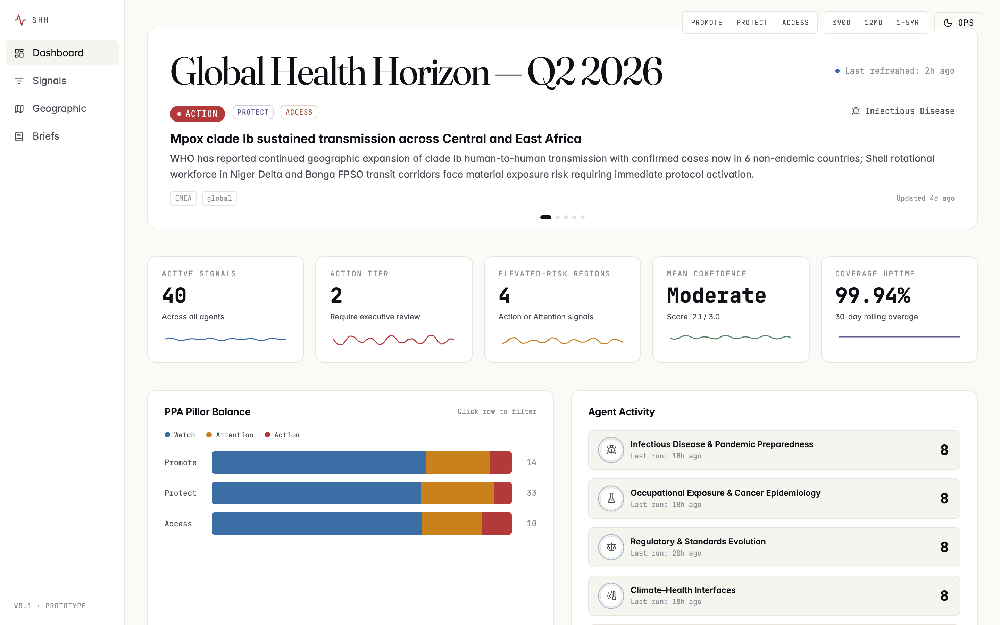

**Bands, top to bottom:**

1. **Hero ticker** — auto-rotates every 7 seconds through the live Action and Attention signals; pause-on-hover. Headline `Global Health Horizon — Q2 2026` set in Fraunces serif. The small blue dot beside *"Last refreshed"* pulses every 2.4 seconds — a deliberate craft moment that telegraphs the agent layer is actively watching, not retrospective.
2. **KPI strip** — 5 tiles in `font-mono` numerals: Active signals, Action-tier count, Elevated-risk regions, Mean confidence, Coverage uptime. Each carries a 30-day sparkline coloured by tier or PPA palette.
3. **PPA balance + Agent activity (split row)** — left, a horizontal stacked bar showing signal volume by PPA pillar with tier breakdown; right, the five-agent grid with last-run timestamps and a subtle activity pulse on each card. Both rows are clickable filters into `/signals`.
4. **Geographic snapshot** — a 2/3-width simplified world map with Shell asset dots and tier-coded signal pins, alongside a regional risk leaderboard. Links into the full `/map`.
5. **Recent signal feed** — vertical list of the eight most recently updated signals; each row is a deep link to `/signals/[id]`.

### 3.2 Signal Explorer — `/signals/`

The analyst's view: dense, filterable, sortable. Used for "show me everything in Protect tier across APAC, sorted by triangulation count" — the sort of question a regional health lead asks before a steering meeting.

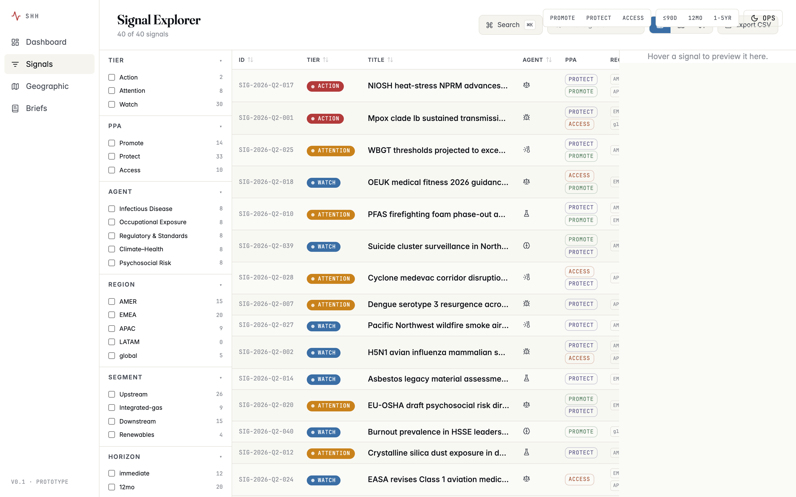

**Components:**

- **Facet rail (240 px, left)** — Tier · PPA · Agent · Region · Segment · Horizon · Confidence · Date range. Each facet shows result counts beside its options so the analyst sees the size of the slice before committing. Active filters appear as removable chips above the rail.
- **Toolbar** — Cmd-K command palette (search by ID or title), text search, view-mode toggle (Table / Card / Timeline), CSV export of the current filtered view.
- **Main pane** — three views over the same filtered set:
  - **Table** (default) — sticky sortable headers, alternating row tint, ten columns including triangulation count and last-updated.
  - **Card** — three-column grid for visual scanning.
  - **Timeline** — five swim lanes (one per agent) plotting signals along a time axis from first detection to last update.
- **QuickPeek panel** — appears on row hover (desktop) showing summary, recommended action and source count without leaving the page.

All filters and the active view are persisted in the URL, so analysts can deep-link `/signals?tier=action&ppa=protect&region=EMEA` to colleagues.

### 3.3 Signal Detail — `/signals/[id]/`

The methodology rigor view. This is where an evaluator decides whether the platform is defensible to an HSSE board. Each of the 40 signals has its own statically-generated page.

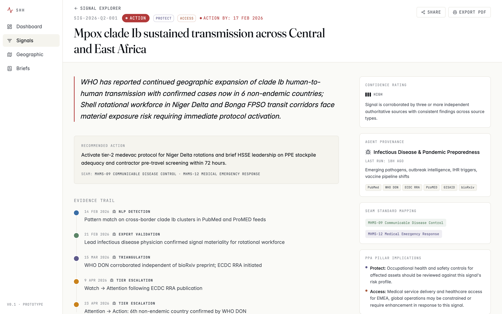

**Layout:**

- **Sticky header** — back link, mono signal ID, large display title, tier badge, PPA chips, *"Action by"* date for Action-tier (computed as `firstDetected + 3 days`), Share + Export-PDF buttons.
- **Main column (2/3)** — italic pull-quote of the *"so what for Shell"* summary; **Recommended action** call-out with explicit SEAM-standard mapping; **Evidence trail** as a vertical timeline (NLP detection → expert validation → triangulation → tier escalation); **Source citations** grouped by type with publisher, identifier, date and external link; **Triangulation diagram** — a small inline SVG that *narrates* corroboration on first paint (active source-type satellites and their connection lines reveal sequentially over ~1.2 s); **Affected assets** — a regional inline map and asset cards.
- **Side column (1/3)** — Confidence rating with rationale; Agent provenance (which of the five agents owns this signal, when it last ran, what it monitors); SEAM mapping; PPA implications; three related-signal links.

The same structure applies to every detail page — here is the NIOSH heat-stress NPRM (the second concurrent Action-tier signal in Q2 2026):

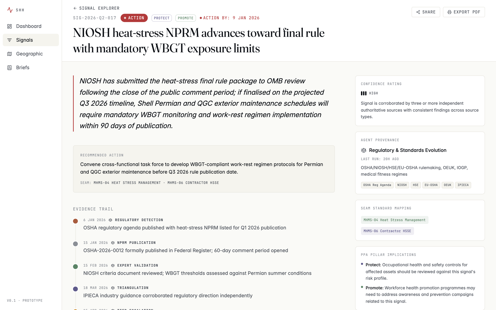

### 3.4 Geographic View — `/map/`

Full-bleed MapLibre GL canvas. The "situation room" register: this is where the *Live · Operational · Forensic* posture of the platform is most visible.

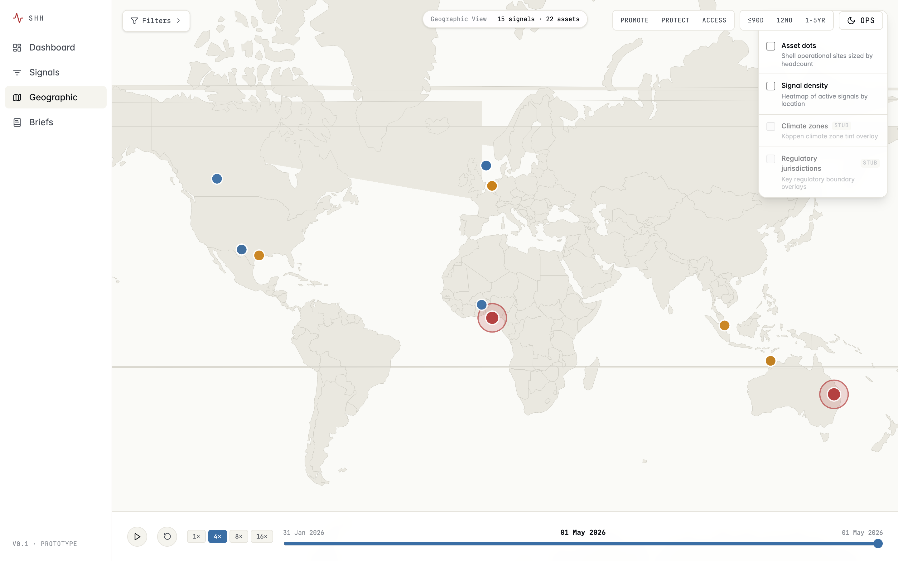

**Defaults and controls:**

- **Asset dots are off by default** so the few signals that warrant executive attention read first. Toggle them on from the layer panel (top-right) when you want to see Shell's operational footprint alongside the signal layer.
- **Signal pins** are sized 8 px (Watch / Attention) or 10 px (Action) and coloured by tier. **Action-tier pins** carry a pulsing ring at 22 ↔ 34 px on a 700 ms cycle — visual hierarchy by motion, not by saturation.
- **Layer toggles** (top-right) — Asset dots, Signal density heatmap, Climate zones, Regulatory jurisdictions.
- **Time scrubber** (bottom) — drag across a 90-day window to watch the signal landscape evolve; play at 4× / 8× / 16× speed.
- **Filter panel** (top-left) — six region presets (Gulf of Mexico, North Sea, Permian, Niger Delta, Asia-Pacific, Pernis cluster) call `map.fitBounds` to fly to that region over ~900 ms; clicking the same preset twice re-flies (escape-from-zoom).
- **Click any signal pin** to open a 420 px right side-sheet with summary, recommended action and a deep link into the signal detail page.

### 3.5 Briefs Archive — `/briefs/`

Long-form intelligence briefs as readable artifacts. This is where the platform demonstrates that Shell receives a real, publishable quarterly product — not just dashboards.

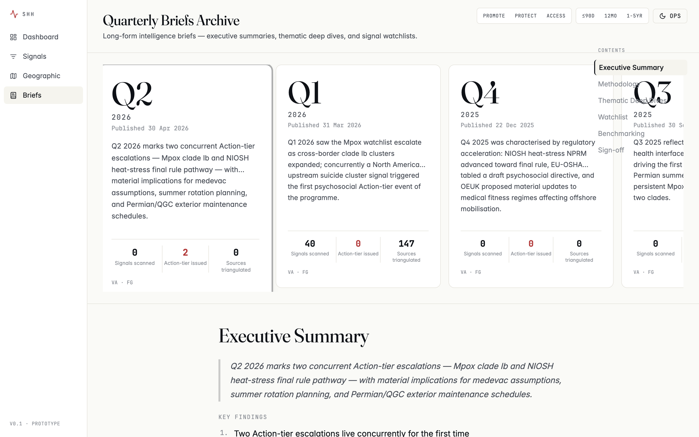

**Components:**

- **Quarter carousel** (top) — four cards spanning Q3 2025 → Q2 2026, each with a key-stat strip (signals scanned, Action-tier issued, sources triangulated), publish date, and signed-off-by initials. The current quarter is scaled and ringed.
- **Long-form reader** — Executive Summary, Methodology Transparency Note, Thematic Deep Dives (each linking out to its cited signals), 12-Month Watchlist table, IOGP/IPIECA Benchmarking, Expert Sign-off. Set in a 720 px max-width column for readability; Fraunces serif headings over Inter body at 17 px / 1.7 line-height.
- **Floating mini-TOC** (right rail on wide screens) — anchor links to each section with active-state via `IntersectionObserver`.

### 3.6 PDF viewer — modal, in-product

The brief's *"View print-ready PDF"* CTA opens the artifact in an in-product modal viewer rather than triggering a download. This is the experience an RFI evaluator wants: read the brief inline, decide whether to keep a copy.

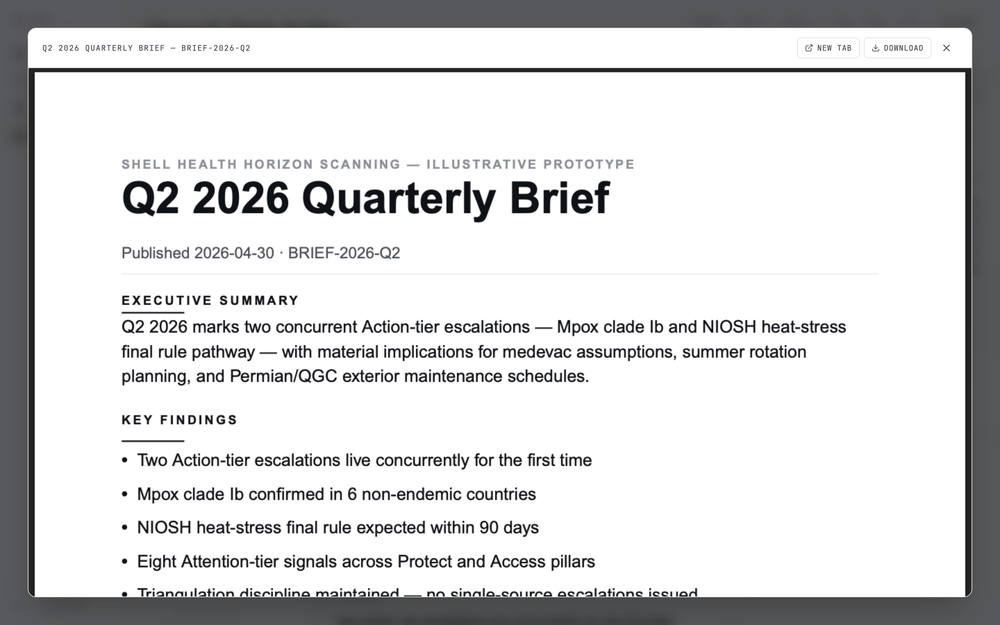

**Affordances:**

- **NEW TAB** — opens the PDF in a fresh browser tab (used as a fallback in mobile Safari, which delegates to Quick Look).
- **DOWNLOAD** — preserves the original file-copy capability for users who want it.
- **X / Escape / backdrop click** — close.

The PDFs themselves are programmatically typeset by `npm run generate:briefs` from the same seed file the in-product reader uses. They include cover, executive summary, key findings, methodology note, thematic deep dives, watchlist with tier-color coding, and named expert sign-off — with the illustrative-prototype disclaimer footer on every page.

---

## 4. Theme system

Two complete themes, both first-class, persisted via `localStorage`:

### Editorial (light) — default
Warm off-white canvas, Fraunces serif display, generous whitespace. This is the default opening posture: cognitive ease on first paint, suited to reading the long-form briefs and reviewing methodology.

### Ops (dark) — situation-room mode
Near-black blue canvas, Inter at the display optical-size axis (no second font file), tight grid, mono accents. Toggle from the top-right rail. This is the register the platform spends most of its time in for active surveillance.

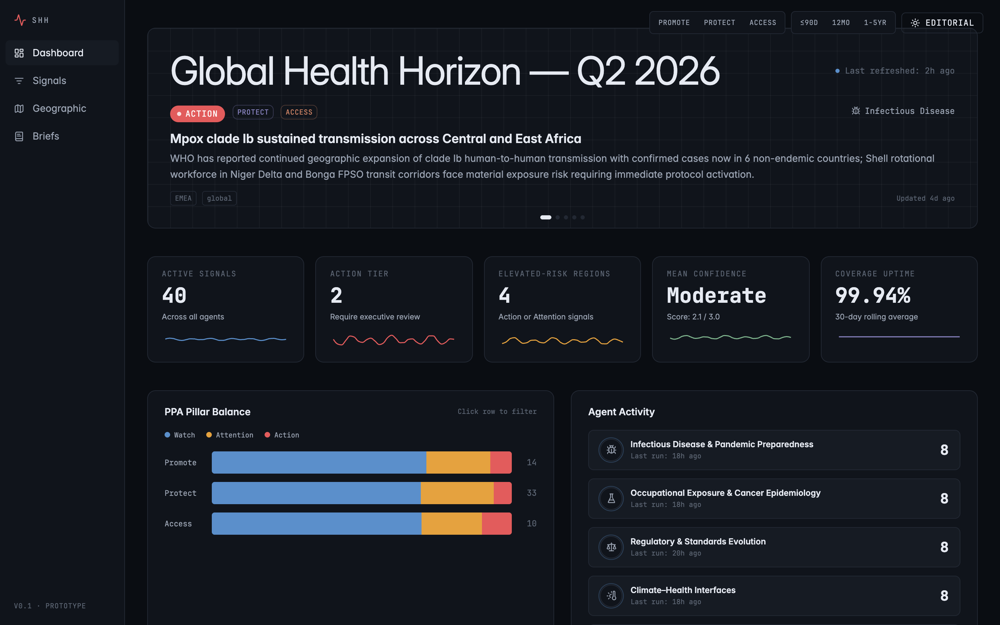

The map is particularly transformed by the theme switch — note the subtle amber graticule on the dark canvas (1 px, 4% opacity) that disappears in the editorial theme:

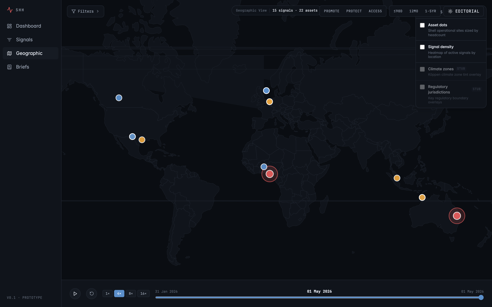

---

## 5. Responsive behaviour

The product is desktop-first (RFI evaluators will open it on a Mac or larger), but every route degrades gracefully to mobile. Below the `lg` breakpoint (1024 px) the 180 px side rail collapses into a slim 56 px top bar with a hamburger drawer; the KPI strip drops from 5 columns to 2; desktop split-rows stack vertically; the Signal Explorer's facet rail moves to a tap-to-open drawer.

| Mobile dashboard | Mobile briefs |
|---|---|
| 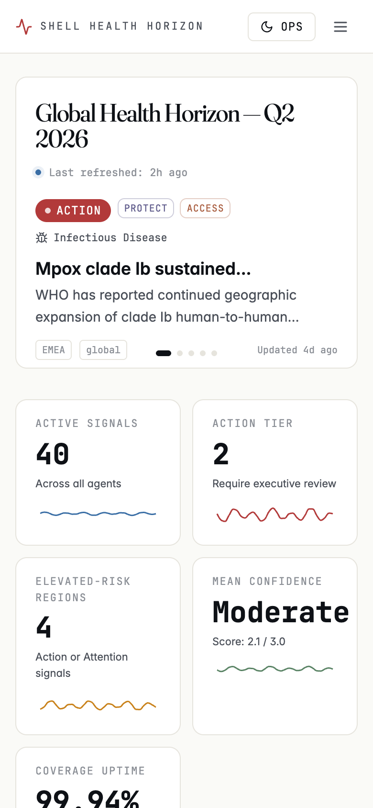 | 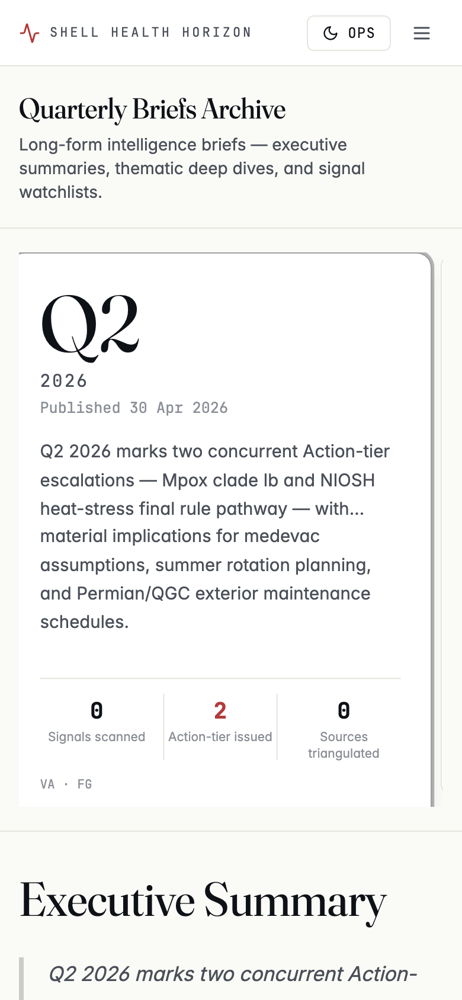 |

Every route reports zero horizontal overflow at 390 px width, verified via headless Chrome at 375–390 px and 1440 px desktop.

---

## 6. Brand & methodology guarantees

- **No Shell Pecten** anywhere in the product (RFI clause 3.d).
- **Illustrative-prototype disclaimer** on a footer chip persistent across all pages: *"Signals are real-event-grounded but not vendor-validated. No Shell-specific operational data."*
- **Named expert sign-off** on every brief (Victor Adekanmbi, MD, PhD — Programme Lead, Health Horizon Scanning · Fangjian Guo, MD, PhD — Lead Methodologist, Evidence Synthesis).
- **Triangulation discipline** — no signal escalates on a single source. Each signal in the prototype carries 3–8 source citations across peer-reviewed literature, WHO/ECDC alerts, regulatory dockets, industry bodies (IOGP/IPIECA), environmental data, and social listening.
- **Confidence ratings** (low / moderate / high) reflect inclusion-criteria fit, study-design strength, and source corroboration — exposed everywhere a signal is referenced.

---

## 7. How to run locally

```bash
git clone https://github.com/olaTechie/health-horizon-dashboard-mockup.git
cd health-horizon-dashboard-mockup
npm install
npm run generate:data       # rebuilds public/data/*.json from the seed
npm run generate:briefs     # regenerates the four PDF briefs from the seed
npm run dev                  # → http://localhost:3000
```

Quality gates:

```bash
npm run typecheck   # tsc --noEmit
npm run lint        # ESLint
npm test            # Vitest (data layer + filter logic)
npm run build       # Next.js static export → out/
```
